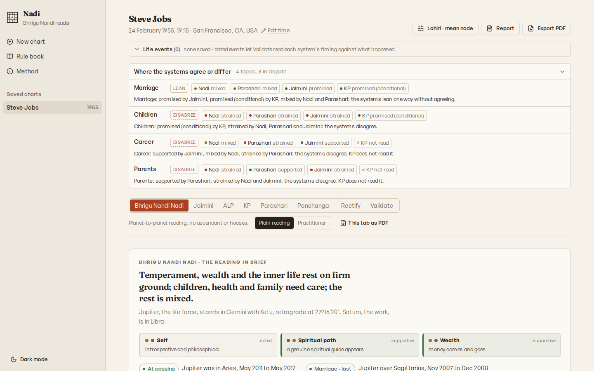
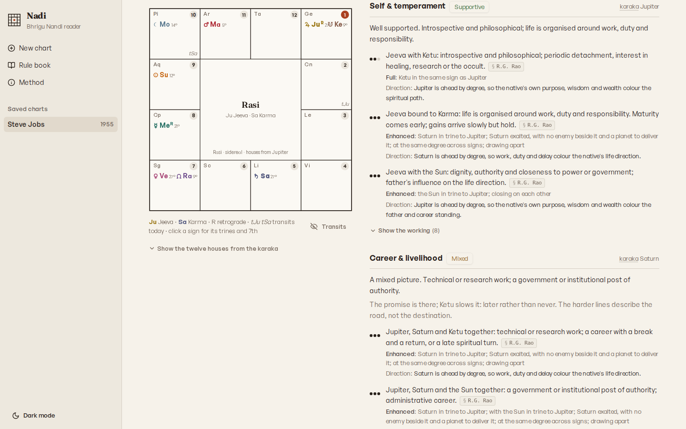

# Nadi

Nadi is a web workbench for Vedic astrology. It casts a sidereal chart with the Swiss Ephemeris and reads it through five schools: Bhrigu Nandi Nadi, Jaimini, Akshaya Lagna Paddhati, Krishnamurti Paddhati and Parashari. It also has a Panchanga tab. Each tab keeps its own rules and citations. Two further tabs, Rectify and Validate, test a birth time and the readings against dated life events.

A published snapshot runs at [astroengine.pplx.app](https://astroengine.pplx.app). It is updated by hand and can lag behind this repository.



## Principles

- **One system per tab.** Readings are never blended. A per-topic agreement panel sets the systems side by side, each with its provenance, instead of merging them into one verdict.
- **Every rule names its source.** Rules are paraphrased and cited by chapter and verse or by page. Some rules aren't stated in any source, and some sources leave a choice open, such as a threshold, a weight or a house convention. The app marks those provisional in the tabs, the report and the PDFs.
- **Plain and practitioner readings.** The plain reading rewords death, loss and disease in terms of risk and strain. The practitioner reading keeps the verse wording and shows sources, weights and working. The app never computes or displays a time of death.
- **Charts of minors.** Under 18, a topic-tagged gate withholds certain readings before anything is rendered: longevity, maraka, arishta, peril, and loss of a parent, spouse or child. The gate applies in the API, the tabs and the PDFs alike.
- **Charts stay on the user's device.** The server writes nothing to disk and keeps no charts. Saved charts and their life events live in the browser's Cache Storage, and Export and Import move them as a JSON file.

## The tabs

| Tab | What it reads |
|---|---|
| Overview | The chart at a glance: a short sentence, the life areas as plain cards, where the systems agree or differ on the same questions, the period running now, the adverse stars and the slow transits. Nothing is blended; each line names its system and links to its tab. |
| Nadi | Bhrigu Nandi Nadi as taught by R.G. Rao and Satyanarayana Naik. There is no lagna and there are no houses. Planets are karakas: Jupiter is the native, Saturn the work and Venus the spouse. In a woman's chart, Venus also stands for the native and Mars for the husband. Lines are read by sign relation and by degree order within a direction. Timing follows the passages of Jupiter and Saturn. |
| Jaimini | Eight chara karakas, navamsa and Karakamsa, rasi drishti, argala, arudha padas, and Chara dasha by K.N. Rao's method, with the Sthira dasha and the Kerala school's Manduka and Brahma dashas. Raja yogas taken from a modern guide's summary carry no sutra number and are marked provisional. The tab also shows the sutra text and the rules drawn from it. |
| ALP | Akshaya Lagna Paddhati, Dr. S. Pothuvudaimoorthy's progressed-lagna method. The lagna moves forward with age at ten years per sign, and the natal planets are read from it. Interpretive rules are being entered from the published volumes chapter by chapter. |
| KP | Krishnamurti Paddhati, Prof. K.S. Krishnamurti's stellar method: KP ayanamsa, Placidus cusps, star, sub and sub-sub lords, significators and Vimshottari timing. The cuspal sub lord decides each matter, and contrary rules stay visible as notes. |
| Parashari | Brihat Parashara Hora Shastra: placements, aspects and yogas, along with Shadbala and bhava bala strength, divisional charts and Ashtakavarga. It also covers padas and karakas, and the dasa systems (Vimshottari, conditional dasas, Kalachakra, sign dasas and the Sudarshana chakra). Brihat Jataka, Sarvartha Chintamani and other classics are read as parallel witnesses. Houses are whole-sign by default, with Sripati and equal bhavas as provisional alternatives for house-based readings. |
| Prasna Marga | The Kerala horary classic. A prasna cast for a question asked now is read from its Arudha lagna, and can be confirmed later against what happened. The same house rules are read against the birth chart, with transits from the birth Moon, marriage compatibility and the reference tables of the text. |
| Panchanga | Vara, tithi, nakshatra, yoga and karana at sunrise, the fortnight's tara days for muhurta, and Moon-based gochara with a transit calendar and Ashtakavarga marks. |
| Rectify | Scores candidate birth times around the recorded one. The methods are KP ruling planets, Moon lords, dated events, transits, Jaimini Chara dasha and marks on the body. Event-based methods are ranked against shuffled dates. |
| Validate | Checks a chart's dated life events against each system's timing, one system at a time, and compares each score with shuffled-date baselines. |

Rectify and Validate are checks, not readings. A high score narrows a birth time or supports a rule; it proves neither.

Each long tab is split into chapters. A short summary opens the tab, a strip along the top moves between chapters, and Everything (All in the practitioner reading) shows the whole tab on one page. The strip remembers the open chapter of each tab while the chart stays open.

Each Nadi line carries a grade: full, enhanced, reduced or cancelled. The reasons behind a grade are dignity, combustion, hemming by friends or enemies, the degree contest within a sign and retrogression. In the practitioner reading, each reason shows its source where Rao or Naik state the principle. A reason without a source is the app's own. The size of every weight is the app's own convention, so the grade is labelled provisional. For planets in one direction, how tight their bond is and whether they are closing also move the grade. That part is the app's reading, so it changes the label but never decides which lines print. A direction line says which planet leads by degree.

An optional birth-time band re-reads the lines at both ends of the band. Lines whose direction, bond or firing changes inside the band say so, while the reading at the stated time is unchanged.



Every chart also has a combined report with a system picker, and PDF exports for each tab and for the whole report. The app includes a rule book (`#/rules`) and a method page (`#/about`) that explains how each system is read.

## Casting a chart

- Date, time (seconds allowed) and place. The place can be searched by name or entered as coordinates.
- Time basis: automatic, from dated statutory rules (the zone time in force, or the birthplace's local mean time before a standard was adopted). It can also be forced to the zone database, local mean time or a fixed offset.
- Ayanamsa: Lahiri (Chitrapaksha), B.V. Raman, Krishnamurti or Sri Yukteshwar. Mean or true nodes.
- Sunrise: upper limb or centre of the disc, with or without refraction.
- House view for Parashari readings: rashi (the default), Sripati or equal.
- Birth-time band for the Nadi reading: as stated, or ±2 to 60 minutes.
- South or North Indian chart layout.

## Running locally

Requirements: Node.js 20.19 or later. The `sweph` package ships prebuilt binaries for Linux (x64 and arm64), macOS (arm64) and Windows (x64). On other platforms it compiles from source, which needs Python 3 and a C/C++ toolchain.

```sh
npm install
npm run dev        # Express with Vite middleware on http://localhost:5000
```

> **macOS note:** port 5000 is often held by the AirPlay Receiver (ControlCenter), which makes `npm run dev`
> fail with `EADDRINUSE`. Either disable AirPlay Receiver in System Settings, or start on another port:
> `PORT=5100 npm run dev`. (A `reusePort` flag was removed because it made the server fail with `ENOTSUP`
> on macOS.)

Production build:

```sh
npm run build      # client to dist/public, server to dist/index.cjs
npm start          # NODE_ENV=production node dist/index.cjs
```

| Variable | Default | Purpose |
|---|---|---|
| `PORT` | `5000` | Port for the API and the app |
| `EPHE_PATH` | none | Where to find the Swiss Ephemeris files if neither `./ephe` nor `../ephe` (relative to the working directory) has them |

Checks:

```sh
npm run check                       # TypeScript
npm test                            # engine regression suite (ephemeris, panchanga, dasa, synthesis, time basis, gentle)
node scripts/check-time-basis.mjs   # time-basis regression; needs the server on port 5000
```

## Project layout

```
client/   React app (Vite, Tailwind, shadcn/ui, wouter hash routing): home, chart tabs, report, rule book, method page
server/   Express API, Swiss Ephemeris wrapper, PDF output (pdfkit), rectification and validation
shared/   Engines and rule books used by both server and client: the systems, grading, age gating, report builders
ephe/     Swiss Ephemeris data files (planets, Moon, main asteroids) covering 1200 to 3000 CE
script/   Build script
scripts/  Regression checks
docs/     Screenshots for this README
```

## API

POST endpoints take a JSON body. Every response is JSON except the two PDFs. No endpoint saves a chart; the short-lived result cache is described under Data and privacy.

| Method | Path | Returns |
|---|---|---|
| POST | `/api/compute` | Positions and every system's reading for a chart |
| POST | `/api/summary` | Home-page card: natal signs, lagna, running dasa and today's slow transits |
| POST | `/api/panchanga` | Panchanga for a date and place, with the planets at that sunrise |
| POST | `/api/gochara-calendar` | Transit verdict stretches for each planet from the natal Moon over a span of years |
| POST | `/api/kp/ruling` | KP ruling planets for a moment and place |
| POST | `/api/kp/sun-path` | Daily Sun positions across a span, for the KP timing view |
| POST | `/api/kp/rectify` | A birth-time rectification scan around the recorded time |
| POST | `/api/validate` | The chart's saved life events checked against each system |
| POST | `/api/pdf` | Chart PDF |
| POST | `/api/report.pdf` | Report PDF; the chart plus `plain` and `modules` |
| GET | `/api/rules`, `/api/jaimini-rules`, `/api/jaimini-sutras` | Rule books |
| GET | `/api/geocode?q=` | Place search |

## Data and privacy

The server computes each response from the birth data in the request and writes nothing to disk. To make repeat requests quick it holds computed readings in memory for up to ten minutes. Each is looked up by a hash of the request and holds no name, notes, life events or birth details, though its timelines still imply the birth date. Saved charts and life events live only in the browser that saved them. Clearing site data removes them, so export a backup. Place search sends the typed name to the [Open-Meteo geocoding API](https://open-meteo.com/en/docs/geocoding-api).

## Sources

The repository holds no copies of these books. Rules are paraphrased, quoted only briefly, and cited by page or by chapter and verse.

- R.G. Rao, Bhrigu Nandi Nadi (Sagar Publications)
- Satyanarayana Naik, Prediction Secrets: Naadi Astrology (Sagar Publications)
- DNA Astrology of Wealth (2022, self-published), on wealth through the nakshatras and Bhrigu Nandi Nadi
- Dr. S. Pothuvudaimoorthy, Akshaya Lagna Paddhati
- Astro Secrets & KP, Parts 1 to 3, and the Kalpurush KP class notes
- Andrew Dutta (Sri Indrajit), KP bhava rules and Birth Time Rectification through KP Astrology
- Brihat Parashara Hora Shastra, in R. Santhanam's translation
- Jaimini Sutras, with K.N. Rao's method for Chara dasha
- Venkatesha, Sarvartha Chintamani, in J.N. Bhasin's translation
- Prasna Marga, in B.V. Raman's translation
- Varahamihira, Brihat Jataka and Brihat Samhita; Mantreswara, Phaladeepika; Kalyanavarma, Saravali; Kalidasa, Uttara Kalamrita; Vaidyanatha, Jataka Parijata; Surya Siddhanta. Several of these are cited from public translations on [wisdomlib](https://www.wisdomlib.org).
- Swiss Ephemeris, Astrodienst AG

## Licence

Copyright (C) 2026 dtmohan.

Nadi is free software: you can redistribute it and/or modify it under the terms of the GNU Affero General Public License as published by the Free Software Foundation, either version 3 of the License, or (at your option) any later version. It is distributed in the hope that it will be useful, but WITHOUT ANY WARRANTY; without even the implied warranty of MERCHANTABILITY or FITNESS FOR A PARTICULAR PURPOSE. See [LICENSE](LICENSE) for the full terms.

The AGPL also covers use over a network. If you run a modified version as a service, you must offer its users the source of that version. The app links to this repository from its method page.

### Third-party material

- The Swiss Ephemeris is used through the `sweph` package, and its data files are bundled in `ephe/`. Astrodienst AG distributes it under either AGPL-3.0 or the Swiss Ephemeris Professional Licence.
- `shared/data/jaimini-sutras.json` holds the Jaimini Sutras text from the 1949 Raman Publications edition (Bangalore) of B. Suryanarain Rao's English translation, with that edition's notes. It was transcribed from the Digital Library of India scan and is not covered by this licence.
- Short quotations from the cited books remain their authors' and are included for citation.
- npm dependencies keep their own licences.
